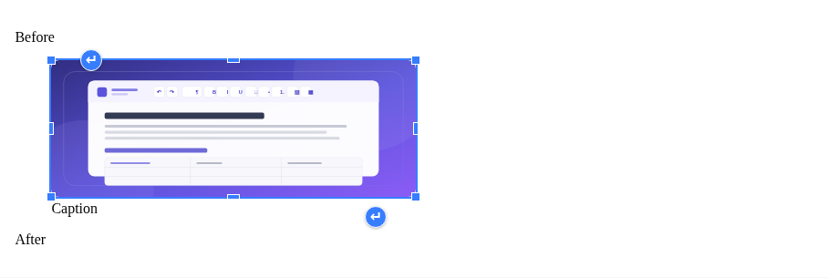
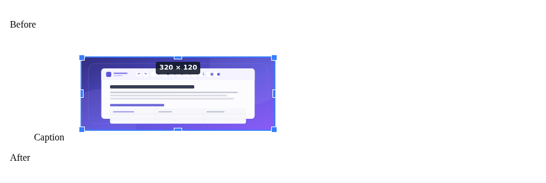

# 图片缩放与区块前后段落工具

2026-09-05，本轮只改进 CMS 图片缩放及图片／表格前后继续输入的操作。
参考 CKEditor 5 的[图片缩放](https://ckeditor.com/docs/ckeditor5/latest/features/images/images-resizing.html)及[图片前后输入](https://ckeditor.com/docs/ckeditor5/latest/features/images/images-overview.html)公开行为，未复制其实现。

## 操作

- 单击图片显示蓝色边框、方形缩放手柄和区块前后插入段落按钮。
- 默认保持当前显示比例；图片属性中明确关闭比例锁后允许自由调整，Shift 可临时保持比例。
- 拖动时显示实际尺寸、不透明预览；原图临时隐藏，避免缩小时叠影。预览与隐藏样式均在正文外，不改动保存 HTML。
- 松手只创建一次撤销记录；Escape、指针取消、失去捕获、窗口失焦、只读及内容替换会取消预览。
- 方向键微调，Shift 加方向键每次调整 10 像素。图片已有行内宽高样式时同步更新相应尺寸，保留其它样式。
- 图片／表格顶部和底部的圆形箭头分别插入前／后段落，悬停时突出区块边界；支持 Tab 聚焦、Enter／空格执行。
- 无需先点击：鼠标移入图片／表格区块即显示段落按钮，移出区块及按钮后立即隐藏，不播放淡出动画。悬停不改变正文、光标或图片选中状态；图片外层容器的空白不计入图片悬停范围。键盘进入按钮会显示，但鼠标随后移出仍立即隐藏；触摸点击保留入口，接鼠标使用时按真实指针隐藏。首次按需加载期间若已移开，不补弹按钮。
- 插入后光标位于新段落。图注和链接不会拆散；混排图片在整段前后插入；表格外插入不改动单元格，单元格内图片则仍在该单元格内插入。
- 图片与段落控件按需加载，共用实例内的延迟加载处理，不加载 Source 或格式化工具；CMS 全局版保留同等图片缩放和段落入口。

选中状态与拖动预览：

## 验证与限制

[机器可读证据](evidence/image-block-tools-2026-09-05/verification.json)记录本次测量。
基础功能完成时，完整 `pnpm test` 通过：403 项单元测试、集成性能预算、API／文档、打包消费者、分发及发布体积检查、125 项 Chromium 产品测试和 6 项 CMS 桌面／移动端回归，包含打包并混淆后的 CMS 全局版操作。全量类型检查及 lint 通过。
新增用例覆盖等比例拖动、相反角定位、一次提交、撤销重做、取消、只读、源码替换、键盘、分屏、图注／链接、表格单元格内图片及行内 CSS 尺寸。

本地连续 60 步鼠标拖动记录 69 个动画帧，帧间隔 P95 为 16.8 ms、最大 16.8 ms，正文仅变更一次。这是本机自动化结果，不代表所有设备或触摸屏体验。
本轮修复了 WebKit 点击裸图片后没有原生选区，导致图片工具无法执行的问题；打开图片工具前会保存明确的图片选区。

冻结体积门禁现已通过：CMS 全局包为 488,091 字节原始大小／149,870 字节 gzip，上限为 500,000／150,000；可选 CMS 初始请求为 511,735／151,994 字节，上限为 514,018／152,376。移除了 25 个被覆盖的重复图标定义，正常 ESM 的 74 个最终图标逐项对比保持相同；仅纯 WYSIWYG 全局包排除不支持的 Source 控件和对应图标，ESM 的 Source 功能保留。未提高任何预算。

[加载测量](evidence/image-block-tools-2026-09-05/loading.json)还验证了 10／100／500 KiB 文档的 Source 首次和重复进入延迟，以及按需格式化和严格 CSP 下恢复加载。新增图片和段落工具模块未出现在初始请求图中。

[跨浏览器记录](evidence/image-block-tools-2026-09-05/cross-browser.json)：使用已有的 Playwright 1.62.1 Ubuntu 容器绕过宿主依赖问题，Firefox／WebKit 的新增交互专项共 8 项全部通过。额外将原 Chromium 套件中名称含 image／table 的用例扩展到这两个浏览器，结果为 30 项通过、12 项失败；涉及测试直接调用不支持的 ShadowRoot.getSelection、表格缩放／菜单／输入、格式及上传路径。这些额外失败保留在记录中，没有将整套产品标记为跨浏览器通过。

新增专项已接入 `playwright.cross-browser.config.ts`，可用 `pnpm test:browser:cross --project firefox-image-tools --project webkit-image-tools` 单独重跑。

历史淡出方案验证（已被下述即时悬停行为替代）：[记录](evidence/image-block-tools-2026-09-05/paragraph-fade.json)。最终 Chromium 专项 6 项（含独立包）、Firefox／WebKit 专项 8 项通过，构建、类型、lint 及发布体积检查通过。该阶段全局包为 488,557 字节原始大小／149,958 字节 gzip；以上完整测试和加载测量保留为本轮淡出改动前的基线。

即时悬停补充验证：[记录](evidence/image-block-tools-2026-09-05/paragraph-hover.json)。Chromium 专项 6 项及 Firefox／WebKit 专项 8 项通过，包括无点击悬停、立即隐藏、延迟加载失效处理、正文不变、图注／链接边界及独立打包版。相关单元 9 项、类型、lint、API、文档及体积检查通过；当前全局包为 488,593 字节原始大小／149,943 字节 gzip，预算未变。

表格入口放在左右外侧，避免遮挡标题及单元格文字。最终 Chromium 回归分批通过：122 项编辑区测试及重建后的 3 项独立包测试；位置调整后 Firefox／WebKit 的 4 项段落专项再次通过。

离开未隐藏的修复：[记录](evidence/image-block-tools-2026-09-05/paragraph-hide-fix.json)。已复现外层 figure 空白仍被算作悬停范围的问题，并移除了强制常显的媒体查询和焦点样式。完整 Chromium 回归 125 项通过，最终含延迟加载、焦点残留、触屏设备接鼠标的 4 项 Chromium 专项及 4 项 Firefox／WebKit 段落专项通过。最新全局包为 488,689／149,973 字节（原始／gzip），仍满足原预算。

真实 Safari、辅助技术人工验收及生产部署未执行。
